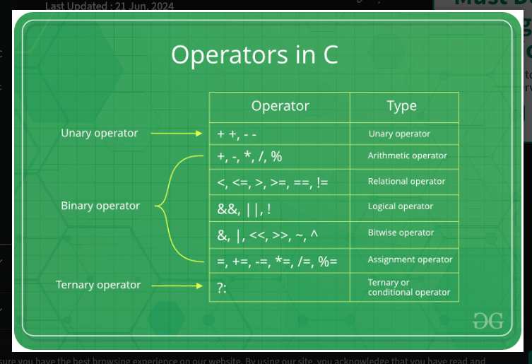

# sizeof(int)

```c
--------------
Data Type	Size
--------------
int	2 or 4 bytes
float	4 bytes
double	8 bytes
char	1 byte

sizeof(int) returns size_t which is as unsigned int.
int value(-1) is converted to unsigned int as part of implicit conversion.
-1 will be represented as 0xFFFF in 16 bit machine(for example).
Usual arithmetic conversions are implicitly performed for common type.
int --> unsigned int --> long --> unsigned long --> long long --> unsigned long long --> float --> double --> long double


Note that we use the %lu format specifer to print the result, instead of %d. It is because the compiler expects the sizeof operator to return a long unsigned int (%lu), instead of int (%d). On some computers it might work with %d, but it is safer to use %lu.

Why Should I Know the Size of Data Types?

Knowing the size of different data types is important because it says something about memory usage and performance.

For example, the size of a char type is 1 byte. Which means if you have an array of 1000 char values, it will occupy 1000 bytes (1 KB) of memory.

Using the right data type for the right purpose will save memory and improve the performance of your program.

You will learn more about the sizeof operator later in this tutorial, and how to use it in different scenarios.

------------------------
Macro	Value	Description
------------------------
CHAR_BIT	8	Defines the number of bits in a byte.
SCHAR_MIN	-128	Defines the minimum value for a signed char.
SCHAR_MAX	+127	Defines the maximum value for a signed char.
UCHAR_MAX	255	Defines the maximum value for an unsigned char.
CHAR_MIN	-128	Defines the minimum value for type char and its value will be equal to SCHAR_MIN if char represents negative values, otherwise zero.
CHAR_MAX	+127	Defines the value for type char and its value will be equal to SCHAR_MAX if char represents negative values, otherwise UCHAR_MAX.
MB_LEN_MAX	16	Defines the maximum number of bytes in a multi-byte character.
SHRT_MIN	-32768	Defines the minimum value for a short int.
SHRT_MAX	+32767	Defines the maximum value for a short int.
USHRT_MAX	65535	Defines the maximum value for an unsigned short int.
INT_MIN	-2147483648	Defines the minimum value for an int.
INT_MAX	+2147483647	Defines the maximum value for an int.
UINT_MAX	4294967295	Defines the maximum value for an unsigned int.
LONG_MIN	-9223372036854775808	Defines the minimum value for a long int.
LONG_MAX	+9223372036854775807	Defines the maximum value for a long int.
ULONG_MAX	18446744073709551615	Defines the maximum value for an unsigned long int.


Unary operators:
++ (increment), 
-- (decrement), 
! (NOT), 
~ (compliment),
 & (address of), 
 * (dereference)

Binary operators:
- Arithmetic Operators ->: ( +, -, *,/, %)
- Logical Operators ->: (&&, ||, !)
- Relational Operators ->: (<, <=, >, >=, ==, !=)
- Bitwise Operators ->: (&, |, <<, >>, ~,^)
- Assignment Operators ->: (=, +=, -=, *=, /=, %=)

Ternary operators ->: (?)


- Misc Operators
```
